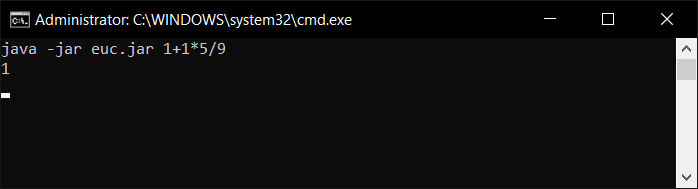

# UnderEngineeredCalculator
A calculator demo. "But its also missing code, so it injects what its missing"

The idea came from a discussion about writing the most obfuscated calculator.



## 💡 Requirements
+ Java Runtime 1.8 **or higher**

## 📚 Links
* [Website](https://konloch.com/UnderEngineeredCalculator/)
* [Discord Server](https://discord.gg/aexsYpfMEf)
* [Download Releases](https://github.com/Konloch/UnderEngineeredCalculator/releases)

## 💻 How To Use
Pipe your math equation into the CLI.

```
java -jar UEC.jar 1+1*5/9
```

## 👨‍ What Is This
+ A blank calculator base with the `Add`, `Sub`, `Mul` & `Div` operators.
+ During runtime the operator functions are written then dynamically loaded.

## 👨‍💻 Disclaimer
+ This is more of a fun experiment, don't take it too seriously.
+ Only 4 operations supported. (`Add`, `Subtract`, `Multiply`, `Divide`)
+ No decimal / floating point / parentheses support. (Integers only)